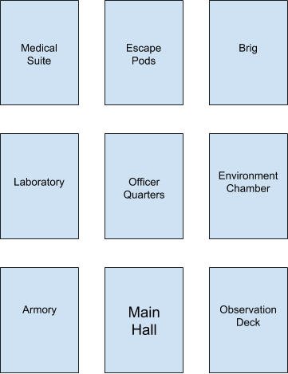

## S.P.A.M.M. - Space Pirates Aliens Mad Max Text Adventure Game

##### Generated by [brandmark.io](https://brandmark.io)
### How to set up and connect to the game on your computer

##### Compile
`make `
##### Start the server
`./main`
##### In a different terminal
`telnet localhost 2323`

Note: If you there are port conflicts uncomment the line in `./main.cpp` and type in a different port number, change the number in the previous command to reflect the change

#### Using PUTTY
Connect to londo
##### Compile
`make `
##### Start the server
`./main 2323`
##### In a different terminal
`telnet localhost 2323`
#### Create a telent proxy from PUTTY to londo and use PUTTY to telnet into the port

#### Default Game Map
Copy and paste load_game.txt into player input.
Loads the following map structure, and adds various items.

